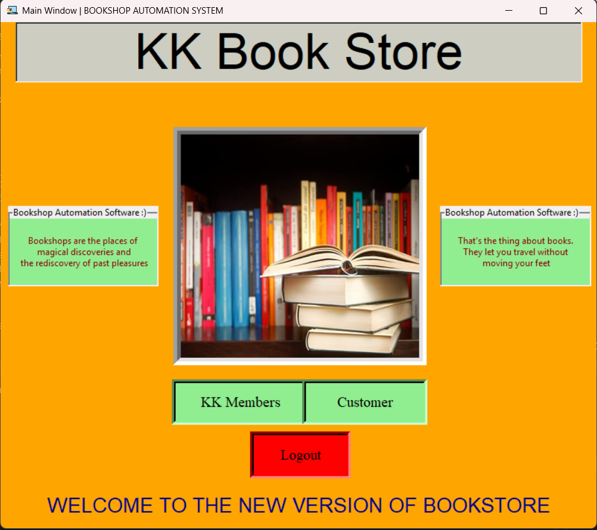

# 📚 Bookshop Automation Software (BAS)

**Author:** Krishnkant Sahu  
**Roll No:** 23CS10035

A Python-based desktop application that automates day-to-day operations of a small bookshop, including inventory management, customer requests, sales processing, and basic reporting.

---

## ✨ Overview

Bookshop Automation Software (BAS) is a role-based desktop application built using Python and Tkinter, designed to simplify bookshop workflows. It enables staff to efficiently manage stock, process sales, track out-of-stock requests, and generate sales insights, while also providing a simple customer-facing interface.

This project is suitable for academic evaluation, mini-project demonstrations, and as a foundation for real-world retail automation systems.

---

## 🚀 Features

### 🔍 Book Search
- Search books by title or author
- Instantly check availability and stock status
- View rack location for in-stock items

### 📝 Customer Requests
- Record complete details for out-of-stock books
- Helps analyze demand and improve inventory planning
- Manager dashboard to review all requests

### 👥 Role-Based Access Control
Separate dashboards and permissions for:
- **Sales Clerk** - Process sales and generate receipts
- **Employee** - Update stock information
- **Manager** - View customer requests and demand analysis
- **Owner** - View inventory levels and low-stock alerts

### 📦 Inventory Management
- Automatic stock updates after sales
- Low-stock visibility for better decision-making
- Track books by ISBN, title, author, and rack number

### 💰 Sales & Reporting
- Generate sales receipts
- Collect and aggregate sales statistics
- Support basic business analysis

---

## 🛠️ Tech Stack

| Component | Technology |
|-----------|-----------|
| **Language** | Python 3.8+ |
| **GUI** | Tkinter |
| **Images** | Pillow (PIL) |
| **Database** | MySQL |
| **DB Connector** | mysql-connector-python |

---

## 📂 Project Structure

```
.
├── Bookshop Automation Software.py   # Main application (Tkinter GUI + DB logic)
├── Bookshop_automation_software.ipynb # Notes / demo notebook
├── Database_Bookshop.sql              # MySQL schema & seed data
├── requirements.txt                   # Python dependencies
├── README.md                          # Project documentation
└── screenshots/                       # Application screenshots
```

---

## ⚙️ Installation & Setup

### 1️⃣ Prerequisites
- Python 3.8 or later
- MySQL Server (local or remote)

### 2️⃣ Clone the Repository
```bash
git clone <repository-url>
cd BookshopAutomationSoftware
```

### 3️⃣ Create Virtual Environment (Recommended)
```bash
python -m venv venv
venv\Scripts\activate
```

### 4️⃣ Install Dependencies
```bash
pip install -r requirements.txt
```

### 5️⃣ Set Up Database
Import the provided schema into MySQL:
```bash
mysql -u <username> -p < Database_Bookshop.sql
```

### 6️⃣ Configure Database Connection
Edit the database credentials in `Bookshop Automation Software.py`, where `create_connection()` is defined:
```python
host="localhost"
user="root"
password="your_password"
database="bookshop_database"
```

### 7️⃣ Run the Application
```bash
python "Bookshop Automation Software.py"
```

---

## 🖼️ Screenshots

### Main Window


### Customer Details Entry


### Book Search


### Shopping Cart


### Manager Sign In


### Sales Clerk Approval


### Sales Invoice


---

## 🧭 Usage Guide

1. **Launch the application**
2. **Choose between:**
   - **Customer Mode** (guest users)
   - **KK Members** (staff login)
3. **Staff credentials** are validated from the `kk_members` table
4. **Users are redirected** to role-specific dashboards

### Default Staff Credentials
| Username | Password | Role |
|----------|----------|------|
| aditya100 | aditya@100 | Manager |
| naveen101 | naveen@101 | Employee |
| raj102 | raj@102 | Sales Clerk |
| kksahu123 | kksahu@123 | Owner |

---

## 🔧 Configuration Notes

- Ensure all required image/icon files (e.g., Bookshop_img2.jpeg, Bookshop_icon_2.ico) are present in the media/ directory
- The application currently uses MySQL
- Can be adapted to SQLite for lightweight local testing

---

## 🚀 Possible Enhancements

- Externalize configuration (DB credentials) to environment variables or `config.ini`
- Implement unit tests for database operations
- Improve UI styling (ttkbootstrap / custom themes)
- Add Docker + MySQL for one-command setup
- Generate detailed sales reports with charts

---

## 🤝 Contributing

Contributions are welcome!

1. Fork the repository
2. Create a feature branch
3. Commit changes with clear messages
4. Open a Pull Request with testing details

---

## 📜 License

This project is available under the MIT License. See the LICENSE file for details.

---

## 📬 Contact

For questions, feedback, or collaboration:

📧 **Email:** krishnkants514@gmail.com
